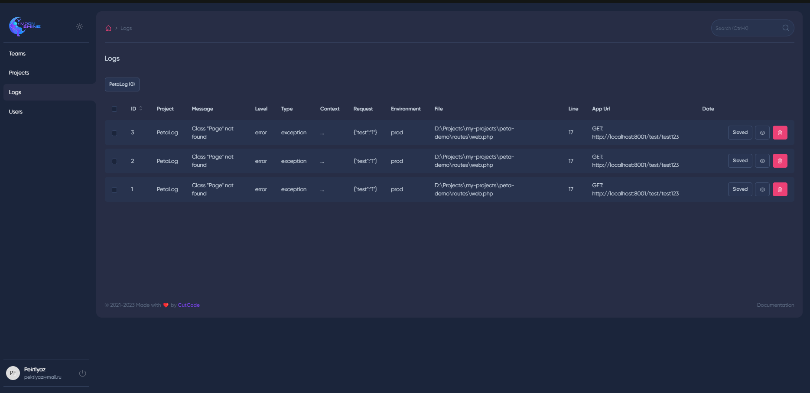

# PetaLog: Laravel Log and Exception Aggregator
PetaLog is a powerful log and exception aggregation tool designed specifically for Laravel projects. It seamlessly captures exceptions from your Laravel applications and centralizes them in a user-friendly interface, allowing developers to efficiently monitor, analyze, and resolve issues.



# Technologies
- Laravel Framework (10.10)
- Moonshine Admin (https://moonshine-laravel.com/)

# Features
- Exception Aggregation: PetaLog captures exceptions thrown by your Laravel application and aggregates them in one centralized location for easy analysis.

- Comprehensive Information: Developers can access detailed information about each error and exception, including context, request, message, file and line.

- Log Information Sending: PetaLog provides a convenient way to send custom log information directly from your Laravel application to the PetaLog project, enhancing your debugging capabilities.

- User-Friendly Interface: The web-based interface is intuitive and user-friendly, ensuring a seamless experience for developers.

# Getting Started
## Installation
Install the packages via Composer:

```bash
composer install
```
Migrate database
```bash
 php artisan migrate
```

Create User
```bash
 php artisan moonshine:user
```


## Usage
Exceptions are automatically captured by PetaLog. Visit the PetaLog interface to view and manage exceptions.

Utilize the provided API to send custom log information to PetaLog from your Laravel application.


# API
```http request
POST: /api/log
```
Request should equals to DTO

```php
public readonly int $project_id,
public readonly string $message,
public readonly string $type,
public readonly string $level,
public readonly string $environment,
public readonly string $app_url,
public readonly string $context,
public readonly ?string $request,
public readonly ?string $file,
public readonly ?int $line
```

# Contributing
We welcome contributions from the community! If you'd like to contribute to PetaLog, please fork project and make pull request with your changes

# License
PetaLog is open-source software licensed under the MIT License.

# Support
If you encounter any issues or have questions, please create an issue on the GitHub repository.
